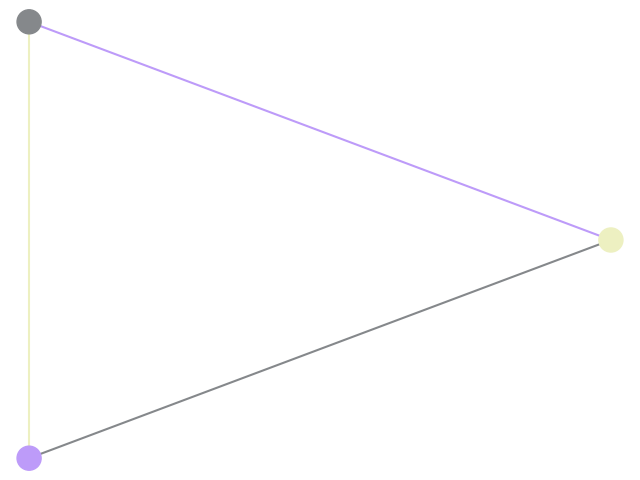
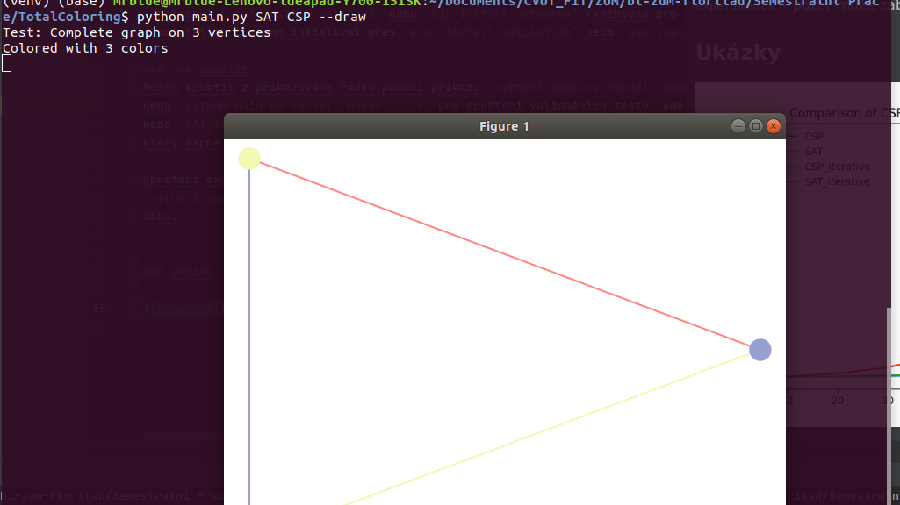
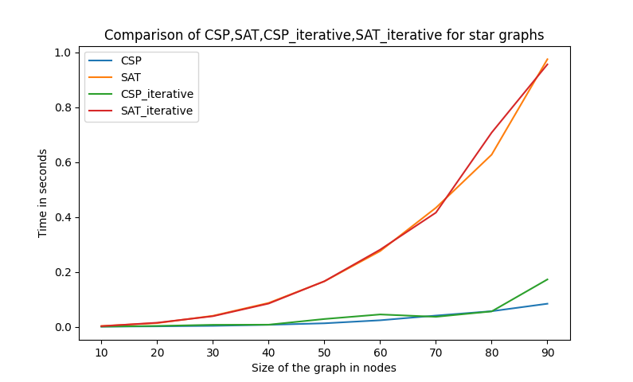

# TotalColoring using CSP a SAT
As part of symbolic AI introduction course

#### Protocol
More extensive Protocol with experiments: [Protocol](protokol.pdf)

## The problem:
Here I solve the total graph coloring problem using **Constraint-Satisfaction** and **SAT** 
(https://en.wikipedia.org/wiki/Total_coloring). It is a coloring which satisfies the following:
- vertices connected with and edge have different color,
- edges sharing an vertex have a different color,
- edges and their incident vertices have different color

The task is to find a complete chromatic number (the minimum amount of colors needed to do a total coloring
of the graph) and then to draw to colored graph. CSP and SAT are then compared in experiments and then I
try to optimize the solution by iteratively defining the problem for CSP and SAT solvers.

### Requirements
- python 3
- python-sat  `pip3 install python-sat` or `pip install python-sat` (library for SAT solvers)
- python-constraint `pip3 install python-constraint` or `pip install python-constraint` (library for CSP solvers)
- networkx `pip3 install networkx` or `pip install networkx` (library for graph creation)
- matplotlib - `pip3 install matplotlib` or `pip install matplotlib` (library for plotting)

### How to run
Run from CLI using `python3 main.py <mode1, mode2, ...>`
or `python main.py <mode1, mode2, ...>` for running validtion test with possible modes: `SAT`, `CSP`, `CSP_iterative`
or `SAT_iterative` which determines what technique is used. Additionally it is possible to add `--draw` which
enables the the colored graphs to be plotted.

Running the experiments for measuring time of individual modes is possible to do by running
`python3 main.py --experiments` or `python main.py --experiments` - watch out it can take some time.

When using `--draw` option, in order to load the next graph you must first close the current graph being
shown.

### Showcase

